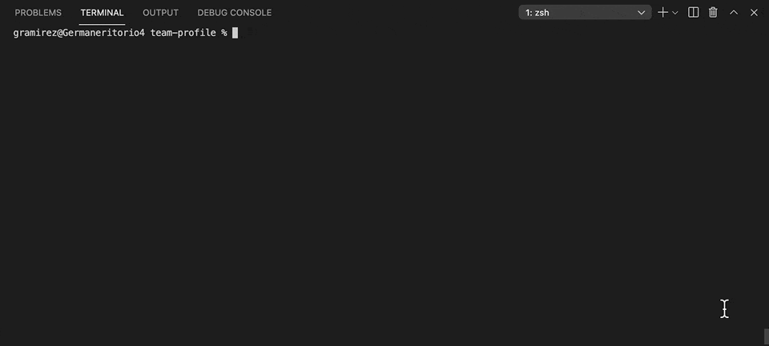
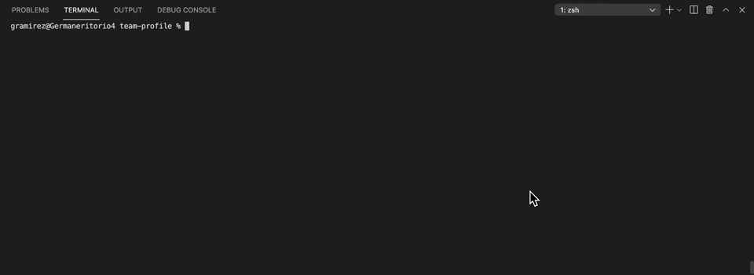

# Team Profile


This project can generate a webpage that displays my team's basic information. So I can access very quickly to their email and github profiles

## Table of Contents

- [Installation](#installation)
- [Usage](#usage)
- [License](#license)
- [Tests](#tests)
- [Questions](#questions)

## Installation

Use the package manager [npm](https://docs.npmjs.com/cli/v7/commands/npm-install) to install all the dependencies that are on the package.json

```bash
npm install
```

## Usage

To Run the system you need to use the follow command

```bash
npm start
```

After answering the question of each members team it will display a HTML page where the information will be visible



## License

This project is licensed under the MIT license.

## Tests

To run the test you will need to run the command

```bash
npm test
```



## [Team Profile GitHub Code](https://github.com/izaack89/team-profile)

## Team Profile References

- [Inquirer](https://www.digitalocean.com/community/tutorials/nodejs-interactive-command-line-prompts) - Inquirer Information
- [Jest](https://jestjs.io/es-ES/docs/next/using-matchers) - Jest Information
- [validation](https://stackoverflow.com/questions/62798907/how-to-clear-wrong-input-in-inquirer-js) - Validation Inquirer
- [Font Awesome](https://fontawesome.com/icons?d=gallery&p=2) - Font Awesome Icons
- [List Group](https://getbootstrap.com/docs/5.0/components/list-group/) - List Group Bootstrap

## Questions

If you have any questions about the repository, open an issue or contact me directly at mitsuominagi@gmail.com. You can find more of my work at [izaack89](https://github.com/izaack89)

## Author

- **German Ramirez** - [GitHub](https://github.com/izaack89/)


